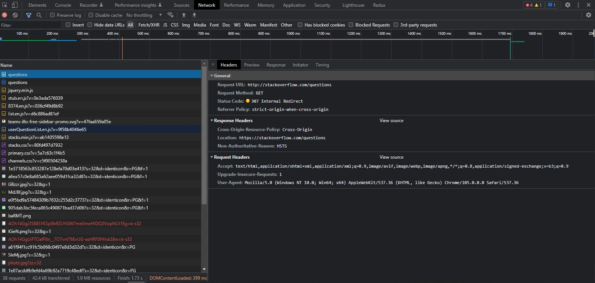

# Домашнее задание к занятию "3.6. Компьютерные сети, лекция 1"

1. Работа c HTTP через телнет.
- Подключитесь утилитой телнет к сайту stackoverflow.com
  `telnet stackoverflow.com 80`
- отправьте HTTP запрос
```bash
GET /questions HTTP/1.0
HOST: stackoverflow.com
[press enter]
[press enter]
```
- В ответе укажите полученный HTTP код, что он означает?

```
301 означает, что ресурс был перемещен на постоянной основе
```

```bash
root@vagrant:~# telnet stackoverflow.com 80
Trying 151.101.129.69...
Connected to stackoverflow.com.
Escape character is '^]'.
GET /questions HTTP/1.0
HOST: stackoverflow.com

HTTP/1.1 301 Moved Permanently
Server: Varnish
Retry-After: 0
Location: https://stackoverflow.com/questions
Content-Length: 0
Accept-Ranges: bytes
Date: Tue, 06 Sep 2022 15:38:41 GMT
Via: 1.1 varnish
Connection: close
X-Served-By: cache-fra19164-FRA
X-Cache: HIT
X-Cache-Hits: 0
X-Timer: S1662478722.883739,VS0,VE0
Strict-Transport-Security: max-age=300
X-DNS-Prefetch-Control: off

Connection closed by foreign host.  
```
    
2. Повторите задание 1 в браузере, используя консоль разработчика F12.
- откройте вкладку `Network`
- отправьте запрос http://stackoverflow.com
- найдите первый ответ HTTP сервера, откройте вкладку `Headers`
- укажите в ответе полученный HTTP код.
- проверьте время загрузки страницы, какой запрос обрабатывался дольше всего?
- приложите скриншот консоли браузера в ответ.
    
```
получили в ответ 307, редирект на https
загрузка страницы 1.73 секунды
самый долгий запрос GET https://stackoverflow.com/questions 248 ms
```


3. Какой IP адрес у вас в интернете?

```bash
root@vagrant:~# dig @resolver4.opendns.com myip.opendns.com +short
185.13.***.*** 
```   

4. Какому провайдеру принадлежит ваш IP адрес? Какой автономной системе AS? Воспользуйтесь утилитой `whois`
   
```bash
root@vagrant:~# whois 185.13.***.**** | grep origin
origin:         AS29069 
```
    
5. Через какие сети проходит пакет, отправленный с вашего компьютера на адрес 8.8.8.8? Через какие AS? Воспользуйтесь утилитой `traceroute`

```bash
root@vagrant:~# traceroute -IAn 8.8.8.8
traceroute to 8.8.8.8 (8.8.8.8), 30 hops max, 60 byte packets
1  10.0.2.2 [*]  0.308 ms  0.235 ms  0.261 ms
2  192.168.50.1 [*]  10.592 ms  10.149 ms  9.847 ms
3  172.16.16.3 [*]  9.544 ms  9.248 ms  9.238 ms
4  10.142.255.20 [*]  8.930 ms  9.433 ms  9.137 ms
5  72.14.204.81 [AS15169]  9.750 ms  10.613 ms  10.273 ms
6  108.170.250.33 [AS15169]  10.012 ms  11.838 ms  11.397 ms
7  108.170.250.51 [AS15169]  16.339 ms  14.435 ms  14.281 ms
8  * * *
9  172.253.66.110 [AS15169]  30.666 ms  30.413 ms  30.159 ms
10  142.250.210.47 [AS15169]  29.880 ms  33.746 ms  33.737 ms
11  * * *
12  * * *
13  * * *
14  * * *
15  * * *
16  * * *
17  * * *
18  * * *
19  8.8.8.8 [AS15169]  21.909 ms  21.662 ms  21.367 ms 
```   

6. Повторите задание 5 в утилите `mtr`. На каком участке наибольшая задержка - delay?

<pre>
root@vagrant:~# mtr 8.8.8.8 -znrc 1
Start: 2022-09-06T16:07:47+0000
HOST: vagrant                     Loss%   Snt   Last   Avg  Best  Wrst StDev
1. AS???    10.0.2.2             0.0%     1    0.6   0.6   0.6   0.6   0.0
2. AS???    192.168.50.1         0.0%     1    3.3   3.3   3.3   3.3   0.0
3. AS???    172.16.16.3          0.0%     1    4.0   4.0   4.0   4.0   0.0
4. AS???    10.142.255.20        0.0%     1    7.6   7.6   7.6   7.6   0.0
5. AS15169  72.14.204.81         0.0%     1    5.4   5.4   5.4   5.4   0.0
6. AS15169  108.170.250.33       0.0%     1    6.4   6.4   6.4   6.4   0.0
7. AS15169  108.170.250.51       0.0%     1    7.5   7.5   7.5   7.5   0.0
8. AS???    ???                 100.0     1    0.0   0.0   0.0   0.0   0.0
<mark>9. AS15169  172.253.66.110       0.0%     1   <u>25.2  25.2  25.2  25.2</u>   0.0</mark>
10. AS15169  142.250.210.47       0.0%     1   22.5  22.5  22.5  22.5   0.0
11. AS???    ???                 100.0     1    0.0   0.0   0.0   0.0   0.0
12. AS???    ???                 100.0     1    0.0   0.0   0.0   0.0   0.0
13. AS???    ???                 100.0     1    0.0   0.0   0.0   0.0   0.0
14. AS???    ???                 100.0     1    0.0   0.0   0.0   0.0   0.0
15. AS???    ???                 100.0     1    0.0   0.0   0.0   0.0   0.0
16. AS???    ???                 100.0     1    0.0   0.0   0.0   0.0   0.0
17. AS???    ???                 100.0     1    0.0   0.0   0.0   0.0   0.0
18. AS???    ???                 100.0     1    0.0   0.0   0.0   0.0   0.0
19. AS15169  8.8.8.8              0.0%     1   21.9  21.9  21.9  21.9   0.0
</pre>

7. Какие DNS сервера отвечают за доменное имя dns.google? Какие A записи? воспользуйтесь утилитой `dig`

```bash
root@vagrant:~# dig +short NS dns.google
ns4.zdns.google.
ns1.zdns.google.
ns2.zdns.google.
ns3.zdns.google.   
```
```bash
root@vagrant:~# dig +short A dns.google
8.8.8.8
8.8.4.4 
```

8. Проверьте PTR записи для IP адресов из задания 7. Какое доменное имя привязано к IP? воспользуйтесь утилитой `dig`

<pre>
root@vagrant:~# dig -x 8.8.8.8

; <<>> DiG 9.16.1-Ubuntu <<>> -x 8.8.8.8
;; global options: +cmd
;; Got answer:
;; ->>HEADER<<- opcode: QUERY, status: NOERROR, id: 9367
;; flags: qr rd ra; QUERY: 1, ANSWER: 1, AUTHORITY: 0, ADDITIONAL: 1

;; OPT PSEUDOSECTION:
; EDNS: version: 0, flags:; udp: 65494
;; QUESTION SECTION:
;8.8.8.8.in-addr.arpa.          IN      PTR

;; ANSWER SECTION:
<mark>8.8.8.8.in-addr.arpa.   5480    IN      PTR     dns.google.</mark>

;; Query time: 0 msec
;; SERVER: 127.0.0.53#53(127.0.0.53)
;; WHEN: Tue Sep 06 16:36:02 UTC 2022
;; MSG SIZE  rcvd: 73
</pre>

<pre>
root@vagrant:~# dig -x 8.8.4.4

; <<>> DiG 9.16.1-Ubuntu <<>> -x 8.8.4.4
;; global options: +cmd
;; Got answer:
;; ->>HEADER<<- opcode: QUERY, status: NOERROR, id: 51054
;; flags: qr rd ra; QUERY: 1, ANSWER: 1, AUTHORITY: 0, ADDITIONAL: 1

;; OPT PSEUDOSECTION:
; EDNS: version: 0, flags:; udp: 65494
;; QUESTION SECTION:
;4.4.8.8.in-addr.arpa.          IN      PTR

;; ANSWER SECTION:
<mark>4.4.8.8.in-addr.arpa.   7134    IN      PTR     dns.google.</mark>

;; Query time: 0 msec
;; SERVER: 127.0.0.53#53(127.0.0.53)
;; WHEN: Tue Sep 06 16:36:41 UTC 2022
;; MSG SIZE  rcvd: 73
</pre>