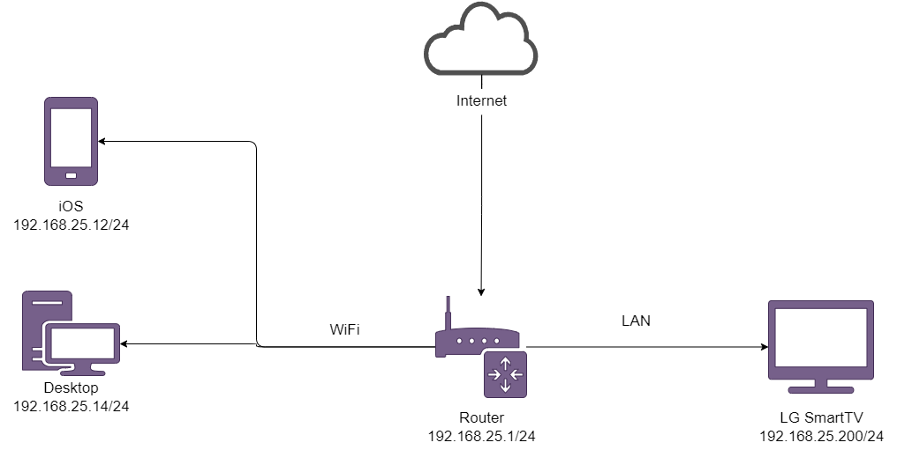

1. Подключитесь к публичному маршрутизатору в интернет. Найдите маршрут к вашему публичному IP
```
telnet route-views.routeviews.org
Username: rviews
show ip route x.x.x.x/32
show bgp x.x.x.x/32
```

```bash
route-views>show ip route 185.13.112.38
Routing entry for 185.13.112.0/22
  Known via "bgp 6447", distance 20, metric 0
  Tag 2497, type external
  Last update from 202.232.0.2 6w6d ago
  Routing Descriptor Blocks:
  * 202.232.0.2, from 202.232.0.2, 6w6d ago
      Route metric is 0, traffic share count is 1
      AS Hops 4
      Route tag 2497
      MPLS label: none
route-views>show bgp 185.13.112.38
BGP routing table entry for 185.13.112.0/22, version 2369173414
Paths: (23 available, best #22, table default)
  Not advertised to any peer
  Refresh Epoch 1
  8283 57866 9002 42610 29069, (aggregated by 29069 172.16.16.2)
    94.142.247.3 from 94.142.247.3 (94.142.247.3)
      Origin IGP, metric 0, localpref 100, valid, external
      Community: 8283:15 9002:9002 9002:64667
      unknown transitive attribute: flag 0xE0 type 0x20 length 0xC
        value 0000 205B 0000 0006 0000 000F
      path 7FE15558FE48 RPKI State not found
      rx pathid: 0, tx pathid: 0
  Refresh Epoch 1
  20130 6939 1273 12389 42610 29069, (aggregated by 29069 172.16.16.2)
    140.192.8.16 from 140.192.8.16 (140.192.8.16)
      Origin IGP, localpref 100, valid, external
      path 7FE15020E078 RPKI State not found
      rx pathid: 0, tx pathid: 0
  Refresh Epoch 1
  20912 3257 1273 12389 42610 29069, (aggregated by 29069 172.16.16.2)
    212.66.96.126 from 212.66.96.126 (212.66.96.126)
      Origin IGP, localpref 100, valid, external
      Community: 3257:8070 3257:30352 3257:50001 3257:53900 3257:53902 20912:65004
      path 7FE0F7525408 RPKI State not found
      rx pathid: 0, tx pathid: 0
  Refresh Epoch 1
  49788 12552 12389 12389 12389 12389 12389 12389 42610 29069, (aggregated by 29069 172.16.16.2)
    91.218.184.60 from 91.218.184.60 (91.218.184.60)
      Origin IGP, localpref 100, valid, external
      Community: 12552:12000 12552:12100 12552:12101 12552:22000
      Extended Community: 0x43:100:1
      path 7FE0AF6B6A78 RPKI State not found
      rx pathid: 0, tx pathid: 0
  Refresh Epoch 1
  3333 1273 12389 42610 29069, (aggregated by 29069 172.16.16.2)
    193.0.0.56 from 193.0.0.56 (193.0.0.56)
      Origin IGP, localpref 100, valid, external
      Community: 1273:12276 1273:32090
      path 7FE0C4F92BB0 RPKI State not found
      rx pathid: 0, tx pathid: 0
  Refresh Epoch 1
  53767 174 12389 12389 12389 12389 12389 12389 42610 29069, (aggregated by 29069 172.16.16.2)
    162.251.163.2 from 162.251.163.2 (162.251.162.3)
      Origin IGP, localpref 100, valid, external
      Community: 174:21101 174:22005 53767:5000
      path 7FE13BAF9E48 RPKI State not found
      rx pathid: 0, tx pathid: 0
  Refresh Epoch 1
  7660 2516 12389 42610 29069, (aggregated by 29069 172.16.16.2)
    203.181.248.168 from 203.181.248.168 (203.181.248.168)
      Origin IGP, localpref 100, valid, external
      Community: 2516:1050 7660:9003
      path 7FE0E86F9FE8 RPKI State not found
      rx pathid: 0, tx pathid: 0
  Refresh Epoch 1
  101 3356 12389 12389 12389 12389 12389 12389 42610 29069, (aggregated by 29069 172.16.16.2)
    209.124.176.223 from 209.124.176.223 (209.124.176.223)
      Origin IGP, localpref 100, valid, external
      Community: 101:20100 101:20110 101:22100 3356:2 3356:22 3356:100 3356:123 3356:501 3356:903 3356:2065
      Extended Community: RT:101:22100
      path 7FE10D924AA0 RPKI State not found
      rx pathid: 0, tx pathid: 0
  Refresh Epoch 1
  3561 3910 3356 12389 12389 12389 12389 12389 12389 42610 29069, (aggregated by 29069 172.16.16.2)
    206.24.210.80 from 206.24.210.80 (206.24.210.80)
      Origin IGP, localpref 100, valid, external
      path 7FE08AEACBD8 RPKI State not found
      rx pathid: 0, tx pathid: 0
  Refresh Epoch 1
  3267 12389 42610 29069, (aggregated by 29069 172.16.16.2)
    194.85.40.15 from 194.85.40.15 (185.141.126.1)
      Origin IGP, metric 0, localpref 100, valid, external
      path 7FE185602368 RPKI State not found
      rx pathid: 0, tx pathid: 0
  Refresh Epoch 1
  4901 6079 3257 1273 12389 42610 29069, (aggregated by 29069 172.16.16.2)
    162.250.137.254 from 162.250.137.254 (162.250.137.254)
      Origin IGP, localpref 100, valid, external
      Community: 65000:10100 65000:10300 65000:10400
      path 7FE0C20CEAD0 RPKI State not found
      rx pathid: 0, tx pathid: 0
  Refresh Epoch 1
  701 1273 12389 42610 29069, (aggregated by 29069 172.16.16.2)
    137.39.3.55 from 137.39.3.55 (137.39.3.55)
      Origin IGP, localpref 100, valid, external
      path 7FE0E728F558 RPKI State not found
      rx pathid: 0, tx pathid: 0
  Refresh Epoch 1
  3356 12389 12389 12389 12389 12389 12389 42610 29069, (aggregated by 29069 172.16.16.2)
    4.68.4.46 from 4.68.4.46 (4.69.184.201)
      Origin IGP, metric 0, localpref 100, valid, external
      Community: 3356:2 3356:22 3356:100 3356:123 3356:501 3356:903 3356:2065
      path 7FE0E1C22140 RPKI State not found
      rx pathid: 0, tx pathid: 0
  Refresh Epoch 1
  57866 9002 42610 29069, (aggregated by 29069 172.16.16.2)
    37.139.139.17 from 37.139.139.17 (37.139.139.17)
      Origin IGP, metric 0, localpref 100, valid, external
      Community: 9002:9002 9002:64667
      path 7FE1599F9708 RPKI State not found
      rx pathid: 0, tx pathid: 0
  Refresh Epoch 1
  19214 3257 1273 12389 42610 29069, (aggregated by 29069 172.16.16.2)
    208.74.64.40 from 208.74.64.40 (208.74.64.40)
      Origin IGP, localpref 100, valid, external
      Community: 3257:8021 3257:30398 3257:50002 3257:51200 3257:51201
      path 7FE091DDEB28 RPKI State not found
      rx pathid: 0, tx pathid: 0
  Refresh Epoch 1
  1351 6939 1273 12389 42610 29069, (aggregated by 29069 172.16.16.2)
    132.198.255.253 from 132.198.255.253 (132.198.255.253)
      Origin IGP, localpref 100, valid, external
      path 7FE0EA9E0228 RPKI State not found
      rx pathid: 0, tx pathid: 0
  Refresh Epoch 1
  3303 1273 12389 42610 29069, (aggregated by 29069 172.16.16.2)
    217.192.89.50 from 217.192.89.50 (138.187.128.158)
      Origin IGP, localpref 100, valid, external
      Community: 1273:12276 1273:32090 3303:1004 3303:1007 3303:1030 3303:3067
      path 7FE175A4E7A8 RPKI State not found
      rx pathid: 0, tx pathid: 0
  Refresh Epoch 1
  7018 1299 1273 12389 42610 29069, (aggregated by 29069 172.16.16.2)
    12.0.1.63 from 12.0.1.63 (12.0.1.63)
      Origin IGP, localpref 100, valid, external
      Community: 7018:5000 7018:37232
      path 7FE0AA88DE18 RPKI State not found
      rx pathid: 0, tx pathid: 0
  Refresh Epoch 1
  852 3257 1273 12389 42610 29069, (aggregated by 29069 172.16.16.2)
    154.11.12.212 from 154.11.12.212 (96.1.209.43)
      Origin IGP, metric 0, localpref 100, valid, external
      path 7FE0C0668AC0 RPKI State not found
      rx pathid: 0, tx pathid: 0
  Refresh Epoch 1
  3549 3356 12389 12389 12389 12389 12389 12389 42610 29069, (aggregated by 29069 172.16.16.2)
    208.51.134.254 from 208.51.134.254 (67.16.168.191)
      Origin IGP, metric 0, localpref 100, valid, external
      Community: 3356:2 3356:22 3356:100 3356:123 3356:501 3356:903 3356:2065 3549:2581 3549:30840
      path 7FE18DDC1EE8 RPKI State not found
      rx pathid: 0, tx pathid: 0
  Refresh Epoch 1
  6939 1273 12389 42610 29069, (aggregated by 29069 172.16.16.2)
    64.71.137.241 from 64.71.137.241 (216.218.252.164)
      Origin IGP, localpref 100, valid, external
      path 7FE13C997F88 RPKI State not found
      rx pathid: 0, tx pathid: 0
  Refresh Epoch 3
  2497 12389 42610 29069, (aggregated by 29069 172.16.16.2)
    202.232.0.2 from 202.232.0.2 (58.138.96.254)
      Origin IGP, localpref 100, valid, external, best
      path 7FE11CFAD798 RPKI State not found
      rx pathid: 0, tx pathid: 0x0
  Refresh Epoch 1
  3257 1273 12389 42610 29069, (aggregated by 29069 172.16.16.2)
    89.149.178.10 from 89.149.178.10 (213.200.83.26)
      Origin IGP, metric 10, localpref 100, valid, external
      Community: 3257:8059 3257:8927 3257:30244 3257:50001 3257:54900 3257:54901
      path 7FE0BCDF6ED8 RPKI State not found
      rx pathid: 0, tx pathid: 0
```
2. Создайте dummy0 интерфейс в Ubuntu. Добавьте несколько статических маршрутов. Проверьте таблицу маршрутизации.

```bash
root@vagrant:~# ip link add dummy0 type dummy
root@vagrant:~# ip addr add 10.0.30.0/24 dev dummy0
root@vagrant:~# ip link set dummy0 up
root@vagrant:~# ip route add 8.8.8.0/24 via 10.0.2.1
root@vagrant:~# ip route add 8.16.28.0/24 via 10.0.30.0
root@vagrant:~# ip route
default via 10.0.2.2 dev eth0 proto dhcp src 10.0.2.15 metric 100
8.8.8.0/24 via 10.0.2.1 dev eth0
8.16.28.0/24 via 10.0.30.0 dev dummy0
10.0.2.0/24 dev eth0 proto kernel scope link src 10.0.2.15
10.0.2.2 dev eth0 proto dhcp scope link src 10.0.2.15 metric 100
10.0.30.0/24 dev dummy0 proto kernel scope link src 10.0.30.0
```

3. Проверьте открытые TCP порты в Ubuntu, какие протоколы и приложения используют эти порты? Приведите несколько примеров.

```bash
root@vagrant:~# ss -tpan
State  Recv-Q Send-Q  Local Address:Port    Peer Address:Port  Process
LISTEN 0      4096    127.0.0.53%lo:53           0.0.0.0:*      users:(("systemd-resolve",pid=609,fd=13))
LISTEN 0      128           0.0.0.0:22           0.0.0.0:*      users:(("sshd",pid=691,fd=3))
LISTEN 0      4096        127.0.0.1:8125         0.0.0.0:*      users:(("netdata",pid=644,fd=37))
LISTEN 0      4096          0.0.0.0:19999        0.0.0.0:*      users:(("netdata",pid=644,fd=4))
ESTAB  0      0           10.0.2.15:22          10.0.2.2:57207  users:(("sshd",pid=1817,fd=4),("sshd",pid=1769,fd=4))
LISTEN 0      4096                *:9101               *:*      users:(("node_exporter",pid=649,fd=3))
LISTEN 0      128              [::]:22              [::]:*      users:(("sshd",pid=691,fd=4))
```

22 - ssh, sshd
53 - dns, systemd-resolve
9101 - http, веб-интерфейс node_exporter
19999 - http, веб-интерфейс netdata
8125 - statsd, netdata

4. Проверьте используемые UDP сокеты в Ubuntu, какие протоколы и приложения используют эти порты?

```bash
root@vagrant:~# ss -upan
State    Recv-Q   Send-Q      Local Address:Port     Peer Address:Port   Process
UNCONN   0        0               127.0.0.1:8125          0.0.0.0:*       users:(("netdata",pid=644,fd=19))
UNCONN   0        0           127.0.0.53%lo:53            0.0.0.0:*       users:(("systemd-resolve",pid=609,fd=12))
UNCONN   0        0          10.0.2.15%eth0:68            0.0.0.0:*       users:(("systemd-network",pid=607,fd=19))
```
53 - dns, systemd-resolve
68 - Используется клиентскими машинами для получения информации о динамической IP-адресации от DHCP-сервера.
8125 - statsd, netdata
5. Используя diagrams.net, создайте L3 диаграмму вашей домашней сети или любой другой сети, с которой вы работали. 

