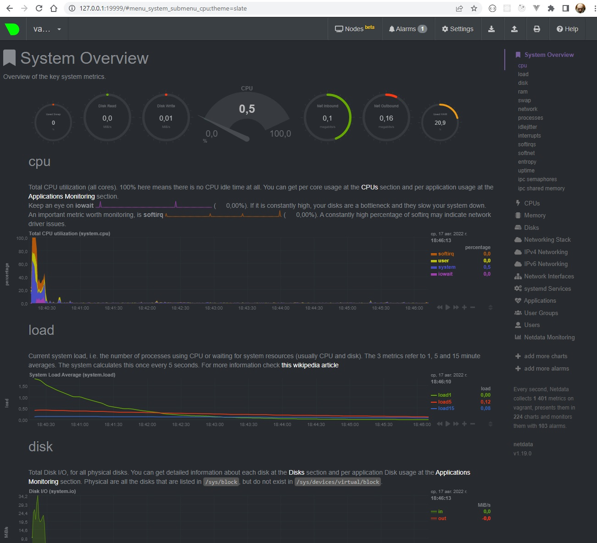

# Домашнее задание к занятию "3.1. Работа в терминале"
## Лекция 1

1. Установите средство виртуализации [Oracle VirtualBox](https://www.virtualbox.org/).

1. Установите средство автоматизации [Hashicorp Vagrant](https://www.vagrantup.com/).

1. В вашем основном окружении подготовьте удобный для дальнейшей работы терминал. Можно предложить:

    * iTerm2 в Mac OS X
    * Windows Terminal в Windows
    * выбрать цветовую схему, размер окна, шрифтов и т.д.
    * почитать о кастомизации PS1/применить при желании.

   Несколько популярных проблем:
    * Добавьте Vagrant в правила исключения перехватывающих трафик для анализа антивирусов, таких как Kaspersky, если у вас возникают связанные с SSL/TLS ошибки,
    * MobaXterm может конфликтовать с Vagrant в Windows,
    * Vagrant плохо работает с директориями с кириллицей (может быть вашей домашней директорией), тогда можно либо изменить [VAGRANT_HOME](https://www.vagrantup.com/docs/other/environmental-variables#vagrant_home), либо создать в системе профиль пользователя с английским именем,
    * VirtualBox конфликтует с Windows Hyper-V и его необходимо [отключить](https://www.vagrantup.com/docs/installation#windows-virtualbox-and-hyper-v),
    * [WSL2](https://docs.microsoft.com/ru-ru/windows/wsl/wsl2-faq#does-wsl-2-use-hyper-v-will-it-be-available-on-windows-10-home) использует Hyper-V, поэтому с ним VirtualBox также несовместим,
    * аппаратная виртуализация (Intel VT-x, AMD-V) должна быть активна в BIOS,
    * в Linux при установке [VirtualBox](https://www.virtualbox.org/wiki/Linux_Downloads) может дополнительно потребоваться пакет `linux-headers-generic` (debian-based) / `kernel-devel` (rhel-based).

1. С помощью базового файла конфигурации запустите Ubuntu 20.04 в VirtualBox посредством Vagrant:

    * Создайте директорию, в которой будут храниться конфигурационные файлы Vagrant. В ней выполните `vagrant init`. Замените содержимое Vagrantfile по умолчанию следующим:

      ```bash
      Vagrant.configure("2") do |config|
          config.vm.box = "bento/ubuntu-20.04"
      end
      ```

    * Выполнение в этой директории `vagrant up` установит провайдер VirtualBox для Vagrant, скачает необходимый образ и запустит виртуальную машину.

    * `vagrant suspend` выключит виртуальную машину с сохранением ее состояния (т.е., при следующем `vagrant up` будут запущены все процессы внутри, которые работали на момент вызова suspend), `vagrant halt` выключит виртуальную машину штатным образом.

1. Ознакомьтесь с графическим интерфейсом VirtualBox, посмотрите как выглядит виртуальная машина, которую создал для вас Vagrant, какие аппаратные ресурсы ей выделены. Какие ресурсы выделены по-умолчанию?

    ```CPU 2, 1024 МБ ОЗУ, VBoxVGA 4 МБ, 64 ГБ ПЗУ```

1. Ознакомьтесь с возможностями конфигурации VirtualBox через Vagrantfile: [документация](https://www.vagrantup.com/docs/providers/virtualbox/configuration.html). Как добавить оперативной памяти или ресурсов процессора виртуальной машине?

    ```bash
    config.vm.provider "virtualbox" do |v|
      v.memory = 1024
      v.cpus = 2
    end
    ```

1. Команда `vagrant ssh` из директории, в которой содержится Vagrantfile, позволит вам оказаться внутри виртуальной машины без каких-либо дополнительных настроек. Попрактикуйтесь в выполнении обсуждаемых команд в терминале Ubuntu.

1. Ознакомиться с разделами `man bash`, почитать о настройках самого bash:
    * какой переменной можно задать длину журнала `history`, и на какой строчке manual это описывается?
    * что делает директива `ignoreboth` в bash?

    ```   
     * 974: HISTFILESIZE 
     * не сохранять команды начинающиеся с пробела и команды дублирующие предыдущие
    ```


1. В каких сценариях использования применимы скобки `{}` и на какой строчке `man bash` это описано?
    
    ```
    1260: brace expansion используются для генерации строк, можно использовать например для создания директорий
    mkdir /usr/local/src/bash/{old,new,dist,bugs}
    ```

1. С учётом ответа на предыдущий вопрос, как создать однократным вызовом `touch` 100000 файлов? Получится ли аналогичным образом создать 300000? Если нет, то почему?

    ```bash
    touch file{1..100000}
    touch file{1..300000} // превышена максимальная длина аргументов ARG_MAX
    ```

1. В man bash поищите по `/\[\[`. Что делает конструкция `[[ -d /tmp ]]`
   
    <strike>`вернет 1 если директория /tmp существует, 0 если нет`</strike>
    
    `вернет 0 если директория /tmp существует, 1 если нет`

1. Основываясь на знаниях о просмотре текущих (например, PATH) и установке новых переменных; командах, которые мы рассматривали, добейтесь в выводе type -a bash в виртуальной машине наличия первым пунктом в списке:

   ```bash
   bash is /tmp/new_path_directory/bash
   bash is /usr/local/bin/bash
   bash is /bin/bash
   ```

   (прочие строки могут отличаться содержимым и порядком)
   В качестве ответа приведите команды, которые позволили вам добиться указанного вывода или соответствующие скриншоты.

    ```bash
    mkdir /tmp/new_path_directory/
    cp /bin/bash /tmp/new_path_directory/
    PATH=/tmp/new_path_directory/:$PATH
    ```

1. Чем отличается планирование команд с помощью `batch` и `at`?
    `batch выполняет команды когда загрузка системы позволяет, at выполняет команды в заданное время`
   
## Лекция 2

1. Какого типа команда `cd`? Попробуйте объяснить, почему она именно такого типа; опишите ход своих мыслей, если считаете что она могла бы быть другого типа.

    ```
    builtin 
    Если бы cd была бы программой, то она бы запускалась в своем окружение, и каталог меняла бы в нем.
    Т.е. после завершения программы текущий каталог останется таким же, как и до старта программы
   ```
1. Какая альтернатива без pipe команде `grep <some_string> <some_file> | wc -l`? `man grep` поможет в ответе на этот вопрос. Ознакомьтесь с [документом](http://www.smallo.ruhr.de/award.html) о других подобных некорректных вариантах использования pipe.
    ```bash 
    grep ... -c 
   ```
1. Какой процесс с PID `1` является родителем для всех процессов в вашей виртуальной машине Ubuntu 20.04?
    ```bash
    systenmd 
   ```

1. Как будет выглядеть команда, которая перенаправит вывод stderr `ls` на другую сессию терминала?
    
    ```bash
    ls no_directory 2>/dev/pts/1 
   ```

1. Получится ли одновременно передать команде файл на stdin и вывести ее stdout в другой файл? Приведите работающий пример.

    ```bash
    cat < a > b
   ```

1. Получится ли находясь в графическом режиме, вывести данные из PTY в какой-либо из эмуляторов TTY? Сможете ли вы наблюдать выводимые данные?

    ```
     Да. Да, если переключится на неё ctrl+alt+f<n>
    ```

1. Выполните команду `bash 5>&1`. К чему она приведет? Что будет, если вы выполните `echo netology > /proc/$$/fd/5`? Почему так происходит?

    ```bash
    Создаем дескриптор пять перенаправляем его в stdout, вывод echo перенаправляем в 5 дескриптор, который перенаправлен в stdout  
   ```

1. Получится ли в качестве входного потока для pipe использовать только stderr команды, не потеряв при этом отображение stdout на pty? Напоминаем: по умолчанию через pipe передается только stdout команды слева от `|` на stdin команды справа.

    ```bash
    cd /no_dir 6>&2 2>&1 1>&6
    ```

1. Что выведет команда `cat /proc/$$/environ`? Как еще можно получить аналогичный по содержанию вывод?

    ```bash
    Выводит переменные окружение, можно также через env 
   ```

1. Используя `man`, опишите что доступно по адресам `/proc/<PID>/cmdline`, `/proc/<PID>/exe`.

    ```bash
     /proc/<PID>/cmdline - read-only файл содержащий коммандную строку процесса, если он не зомби
     /proc/<PID>/exe - в linux 2.2 и более поздних, файл - ссылка содержащая путь до выполняемой команды, 
      под linux 2.0 и более ранних является указателем на запущенный бинарник.
   ```

1. Узнайте, какую наиболее старшую версию набора инструкций SSE поддерживает ваш процессор с помощью `/proc/cpuinfo`

    ```bash
    SSE 4.2 
   ```

1. При открытии нового окна терминала и `vagrant ssh` создается новая сессия и выделяется pty. Это можно подтвердить командой `tty`, которая упоминалась в лекции 3.2. Однако:

    ```bash
	vagrant@netology1:~$ ssh localhost 'tty'
	not a tty
    ```

   Почитайте, почему так происходит, и как изменить поведение.

    ```
    По умолчанию, когда вы запускаете команду на удаленном компьютере с помощью ssh, TTY не выделяется для удаленного сеанса.
    Это поведение можно изменить с помощью флага -t
    ```
1. Бывает, что есть необходимость переместить запущенный процесс из одной сессии в другую. Попробуйте сделать это, воспользовавшись `reptyr`. Например, так можно перенести в `screen` процесс, который вы запустили по ошибке в обычной SSH-сессии.   

    ```bash
    Попробовал, со screen ssh терминал просто подвис, попробовал top, запустил локально отрисовалась табличка, через ssh сделал reptyr этого PID, локально он завершился, отрисовался на ssh 
   ```

1. `sudo echo string > /root/new_file` не даст выполнить перенаправление под обычным пользователем, так как перенаправлением занимается процесс shell'а, который запущен без `sudo` под вашим пользователем. Для решения данной проблемы можно использовать конструкцию `echo string | sudo tee /root/new_file`. Узнайте что делает команда `tee` и почему в отличие от `sudo echo` команда с `sudo tee` будет работать.

    ```bash
    tee читает stdin и пишет stdout, работает потому что запущена под sudo
    ```
   
## ОС Лекция 1

1. Какой системный вызов делает команда `cd`? В прошлом ДЗ мы выяснили, что `cd` не является самостоятельной  программой, это `shell builtin`, поэтому запустить `strace` непосредственно на `cd` не получится. Тем не менее, вы можете запустить `strace` на `/bin/bash -c 'cd /tmp'`. В этом случае вы увидите полный список системных вызовов, которые делает сам `bash` при старте. Вам нужно найти тот единственный, который относится именно к `cd`. Обратите внимание, что `strace` выдаёт результат своей работы в поток stderr, а не в stdout.

    ```bash
    chdir("/tmp")
    Обратил, пайпом грепнуть не получится 
   ```

1. Попробуйте использовать команду `file` на объекты разных типов на файловой системе. Например:
    ```bash
    vagrant@netology1:~$ file /dev/tty
    /dev/tty: character special (5/0)
    vagrant@netology1:~$ file /dev/sda
    /dev/sda: block special (8/0)
    vagrant@netology1:~$ file /bin/bash
    /bin/bash: ELF 64-bit LSB shared object, x86-64
    ```
   Используя `strace` выясните, где находится база данных `file` на основании которой она делает свои догадки.   

    ```bash
    /etc/magic 
   ```

1. Предположим, приложение пишет лог в текстовый файл. Этот файл оказался удален (deleted в lsof), однако возможности сигналом сказать приложению переоткрыть файлы или просто перезапустить приложение – нет. Так как приложение продолжает писать в удаленный файл, место на диске постепенно заканчивается. Основываясь на знаниях о перенаправлении потоков предложите способ обнуления открытого удаленного файла (чтобы освободить место на файловой системе).

    ```bash
    > /proc/$PROC/fd/$FD
    ```

1. Занимают ли зомби-процессы какие-то ресурсы в ОС (CPU, RAM, IO)?
    ```bash
    нет 
   ```
1. В iovisor BCC есть утилита `opensnoop`:
    ```bash
    root@vagrant:~# dpkg -L bpfcc-tools | grep sbin/opensnoop
    /usr/sbin/opensnoop-bpfcc
    ```
   На какие файлы вы увидели вызовы группы `open` за первую секунду работы утилиты? Воспользуйтесь пакетом `bpfcc-tools` для Ubuntu 20.04. Дополнительные [сведения по установке](https://github.com/iovisor/bcc/blob/master/INSTALL.md).

    ```bash
    PID    COMM               FD ERR PATH
    635    irqbalance          6   0 /proc/interrupts
    635    irqbalance          6   0 /proc/stat
    635    irqbalance          6   0 /proc/irq/20/smp_affinity
    635    irqbalance          6   0 /proc/irq/0/smp_affinity
    635    irqbalance          6   0 /proc/irq/1/smp_affinity
    635    irqbalance          6   0 /proc/irq/8/smp_affinity
    635    irqbalance          6   0 /proc/irq/12/smp_affinity
    635    irqbalance          6   0 /proc/irq/14/smp_affinity
    635    irqbalance          6   0 /proc/irq/15/smp_affinity 
   ```
1. Какой системный вызов использует `uname -a`? Приведите цитату из man по этому системному вызову, где описывается альтернативное местоположение в `/proc`, где можно узнать версию ядра и релиз ОС.

    ```bash
    Вызов uname. У меня почему-то в мануале нет этого, там написано что должен быть второй раздел мана, но у меня его нет. В интернете пишут так
   /proc/version
              This string identifies the kernel version that is currently running.  It includes the contents of  /proc/sys/kernel/ostype,  /proc/sys/kernel/osrelease
              and /proc/sys/kernel/version. 
   ```

1. Чем отличается последовательность команд через `;` и через `&&` в bash? Например:
    ```bash
    root@netology1:~# test -d /tmp/some_dir; echo Hi
    Hi
    root@netology1:~# test -d /tmp/some_dir && echo Hi
    root@netology1:~#
    ```
   Есть ли смысл использовать в bash `&&`, если применить `set -e`?
   
    ```bash
    ; выполняет команды последовательно
    && выполняет команды с проверкой exit code, следующая выполнится только если предыдущая завершилась с кодом 0 
    
    смысла нет, так как -e Exit immediately if a command exits with a non-zero status.
   ```
1. Из каких опций состоит режим bash `set -euxo pipefail` и почему его хорошо было бы использовать в сценариях?

    ```bash
    -e - завершит выполение в случае ошибке
    -u - завершит выполнение при наличии незаданных переменных
    -x - все команды и их аргументы будут выведены на экран
    -o pipefail - итоговым статусам пайпа будет статус последней не нулевой команды, или ноль если все команды вернули ноль
    
     Такой сценарий делает скрипт более безопасным
   ```

1. Используя `-o stat` для `ps`, определите, какой наиболее часто встречающийся статус у процессов в системе. В `man ps` ознакомьтесь (`/PROCESS STATE CODES`) что значат дополнительные к основной заглавной буквы статуса процессов. Его можно не учитывать при расчете (считать S, Ss или Ssl равнозначными).
    ```bash
    Ss - S ожидающий процесс s лидер сессии
    R+ - R выполняющийся процесс + в foreground
   ```
   
## ОС Лекция 2

1. На лекции мы познакомились с [node_exporter](https://github.com/prometheus/node_exporter/releases). В демонстрации его исполняемый файл запускался в background. Этого достаточно для демо, но не для настоящей production-системы, где процессы должны находиться под внешним управлением. Используя знания из лекции по systemd, создайте самостоятельно простой [unit-файл](https://www.freedesktop.org/software/systemd/man/systemd.service.html) для node_exporter:

    * поместите его в автозагрузку,
    * предусмотрите возможность добавления опций к запускаемому процессу через внешний файл (посмотрите, например, на `systemctl cat cron`),
    * удостоверьтесь, что с помощью systemctl процесс корректно стартует, завершается, а после перезагрузки автоматически поднимается.
    
    ```bash
    установил node_exporter, запустил, пробросил 9100 порт на виртуалку, открыл в браузере http://127.0.0.1:9100/metrics, получил такой вывод
    
   # HELP go_gc_duration_seconds A summary of the pause duration of garbage collection cycles.
    # TYPE go_gc_duration_seconds summary
    go_gc_duration_seconds{quantile="0"} 0
    go_gc_duration_seconds{quantile="0.25"} 0
    go_gc_duration_seconds{quantile="0.5"} 0
    go_gc_duration_seconds{quantile="0.75"} 0
    go_gc_duration_seconds{quantile="1"} 0
    go_gc_duration_seconds_sum 0
    go_gc_duration_seconds_count 0
    # HELP go_goroutines Number of goroutines that currently exist.
    # TYPE go_goroutines gauge
    go_goroutines 9
    # HELP go_info Information about the Go environment.
    # TYPE go_info gauge
    go_info{version="go1.17.3"} 1
    # HELP go_memstats_alloc_bytes Number of bytes allocated and still in use.
    # TYPE go_memstats_alloc_bytes gauge
    go_memstats_alloc_bytes 1.399848e+06
    # HELP go_memstats_alloc_bytes_total Total number of bytes allocated, even if freed.
    # TYPE go_memstats_alloc_bytes_total counter
    go_memstats_alloc_bytes_total 1.399848e+06
    # HELP go_memstats_buck_hash_sys_bytes Number of bytes used by the profiling bucket hash table.
    # TYPE go_memstats_buck_hash_sys_bytes gauge
    go_memstats_buck_hash_sys_bytes 1.445967e+06
    # HELP go_memstats_frees_total Total number of frees.
    # TYPE go_memstats_frees_total counter
    go_memstats_frees_total 757
    # HELP go_memstats_gc_cpu_fraction The fraction of this program's available CPU time used by the GC since the program started.
    # TYPE go_memstats_gc_cpu_fraction gauge
    go_memstats_gc_cpu_fraction 0
    # HELP go_memstats_gc_sys_bytes Number of bytes used for garbage collection system metadata.
    # TYPE go_memstats_gc_sys_bytes gauge
    go_memstats_gc_sys_bytes 4.184192e+06
    # HELP go_memstats_heap_alloc_bytes Number of heap bytes allocated and still in use.
    # TYPE go_memstats_heap_alloc_bytes gauge
    go_memstats_heap_alloc_bytes 1.399848e+06 
    ...
   
    далее сделал файлик /etc/systemd/system/node_exporter.service с таким содержанием:
    
    Description=Node Exporter

    [Service]
    ExecStart=/home/vagrant/node_exporter-1.3.1.linux-amd64/node_exporter $PARAMS
    EnvironmentFile=/etc/default/node_exporter
    
    [Install]
    WantedBy=default.target
    
    и файлик /etc/default/node_exporter с содержанием:
   
    PARAMS=--web.listen-address=":9101"
   
    включил сервис
   
    vagrant@vagrant:~$ systemctl enable node_exporter
    ==== AUTHENTICATING FOR org.freedesktop.systemd1.manage-unit-files ===
    Authentication is required to manage system service or unit files.
    Authenticating as: vagrant
    Password:
    ==== AUTHENTICATION COMPLETE ===
    ==== AUTHENTICATING FOR org.freedesktop.systemd1.reload-daemon ===
    Authentication is required to reload the systemd state.
    Authenticating as: vagrant
    Password:
    ==== AUTHENTICATION COMPLETE ===
   
    остановил сервис 
   
    vagrant@vagrant:~$ systemctl stop node_exporter
    ==== AUTHENTICATING FOR org.freedesktop.systemd1.manage-units ===
    Authentication is required to stop 'node_exporter.service'.
    Authenticating as: vagrant
    Password:
    ==== AUTHENTICATION COMPLETE ===
   
    vagrant@vagrant:~$ ps -e | grep node_exporter
    vagrant@vagrant:~$
   
    запустил севрис 
   
    vagrant@vagrant:~$ systemctl start node_exporter
    ==== AUTHENTICATING FOR org.freedesktop.systemd1.manage-units ===
    Authentication is required to start 'node_exporter.service'.
    Authenticating as: vagrant
    Password:
    ==== AUTHENTICATION COMPLETE ===
    vagrant@vagrant:~$ ps -e | grep node_exporter
    1148 ?        00:00:00 node_exporter
   
    после перезапуска
   
    vagrant@vagrant:~$ ps -e | grep node_exporter
    638 ?        00:00:00 node_exporter
    vagrant@vagrant:~$ sudo cat /proc/638/environ
    LANG=en_US.UTF-8PATH=/usr/local/sbin:/usr/local/bin:/usr/sbin:/usr/bin:/sbin:/bin:/snap/binINVOCATION_ID=55dea6224e59428d88a04ef3bb846d9fJOURNAL_STREAM=9:20888PARAMS=--web.listen-address=":9101"
    
    ##PARAMS=--web.listen-address=":9101"
    
    параметры запуска выставляются в файлике /etc/default/node_exporter, в данном случае сервис слушает порт 9101
   ```

1. Ознакомьтесь с опциями node_exporter и выводом `/metrics` по-умолчанию. Приведите несколько опций, которые вы бы выбрали для базового мониторинга хоста по CPU, памяти, диску и сети.

    ```bash
    node_cpu_seconds_total{cpu="0",mode="idle"}
    node_cpu_seconds_total{cpu="0",mode="system"}
    node_cpu_seconds_total{cpu="0",mode="user"}
    process_cpu_seconds_total
    node_memory_MemAvailable_bytes
    node_memory_MemFree_bytes
    node_disk_io_time_seconds_total{device="sda"}
    node_disk_read_bytes_total{device="sda"}
    node_disk_read_time_seconds_total{device="sda"}
    node_disk_write_time_seconds_total{device="sda"}
    node_network_receive_bytes_total{device="eth0"}
    node_network_transmit_bytes_total{device="eth0"}
   ```   

1. Установите в свою виртуальную машину [Netdata](https://github.com/netdata/netdata). Воспользуйтесь [готовыми пакетами](https://packagecloud.io/netdata/netdata/install) для установки (`sudo apt install -y netdata`). После успешной установки:
    * в конфигурационном файле `/etc/netdata/netdata.conf` в секции [web] замените значение с localhost на `bind to = 0.0.0.0`,
    * добавьте в Vagrantfile проброс порта Netdata на свой локальный компьютер и сделайте `vagrant reload`:

    ```bash
    config.vm.network "forwarded_port", guest: 19999, host: 19999
    ```

   После успешной перезагрузки в браузере *на своем ПК* (не в виртуальной машине) вы должны суметь зайти на `localhost:19999`. Ознакомьтесь с метриками, которые по умолчанию собираются Netdata и с комментариями, которые даны к этим метрикам.
      
   ```bash
   Поставил, ознакомился
   ```
   
  
1. Можно ли по выводу `dmesg` понять, осознает ли ОС, что загружена не на настоящем оборудовании, а на системе виртуализации?
   ```bash
   Видимо да =)
   
   vagrant@vagrant:~$ dmesg | grep virtual
    [    0.005741] CPU MTRRs all blank - virtualized system.
    [    0.044705] Booting paravirtualized kernel on KVM
    [    0.616390] Performance Events: PMU not available due to virtualization, using software events only.
    [   14.836544] systemd[1]: Detected virtualization oracle.
   ```
1. Как настроен sysctl `fs.nr_open` на системе по-умолчанию? Узнайте, что означает этот параметр. Какой другой существующий лимит не позволит достичь такого числа (`ulimit --help`)?

    ```bash
    vagrant@vagrant:~$ sysctl fs.nr_open
    fs.nr_open = 1048576 
   
    максимальное количество файловых дескрипторов
    
    vagrant@vagrant:~$ ulimit -Hn
    1048576
    -H        use the `hard' resource limit
    -n        the maximum number of open file descriptors
    
   ```   

1. Запустите любой долгоживущий процесс (не `ls`, который отработает мгновенно, а, например, `sleep 1h`) в отдельном неймспейсе процессов; покажите, что ваш процесс работает под PID 1 через `nsenter`. Для простоты работайте в данном задании под root (`sudo -i`). Под обычным пользователем требуются дополнительные опции (`--map-root-user`) и т.д.
  
    ```bash
    ##pts/1
    root@vagrant:~# unshare -f --pid --mount-proc sleep 1h
   
    ##pts/0
    root@vagrant:~# ps -e | grep sleep
       1356 pts/1    00:00:00 sleep
    root@vagrant:~# nsenter --target 1356 --mount --uts --ipc --net --pid ps aux
    USER         PID %CPU %MEM    VSZ   RSS TTY      STAT START   TIME COMMAND
    root           1  0.0  0.0   5476   516 pts/1    S+   17:57   0:00 sleep 1h
    root           2  0.0  0.3   8888  3424 pts/0    R+   17:58   0:00 ps aux 
   ```
 
1. Найдите информацию о том, что такое `:(){ :|:& };:`. Запустите эту команду в своей виртуальной машине Vagrant с Ubuntu 20.04 (**это важно, поведение в других ОС не проверялось**). Некоторое время все будет "плохо", после чего (минуты) – ОС должна стабилизироваться. Вызов `dmesg` расскажет, какой механизм помог автоматической стабилизации. Как настроен этот механизм по-умолчанию, и как изменить число процессов, которое можно создать в сессии?

    ```bash
    Некая форк-бомба. Бесконечная рекурсивная функция. Часто использутеся для проверки ограничений числа пользовательских процессов на сервере
   
    root@vagrant:~# dmesg | grep fork
    [  295.559245] cgroup: fork rejected by pids controller in /user.slice/user-1000.slice/session-1.scope
   
    root@vagrant:~# ulimit -u
    3554
    
    root@vagrant:~# ulimit -u 10
    root@vagrant:~# ulimit -u
    10
   ```